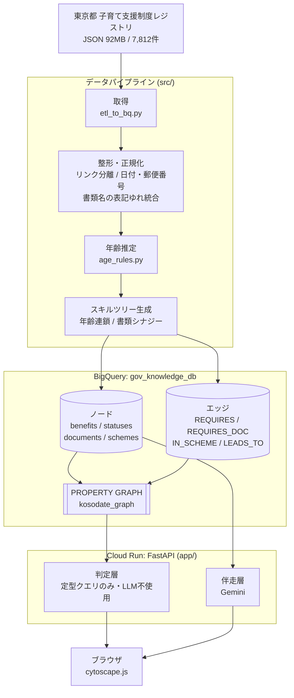

# アーキテクチャ

## 全体像



## 層ごとの責務

### データパイプライン（`src/`）

日次〜週次で回す想定のバッチ。ソース URL から直接 JSON を取得し、ローカルファイルには依存しません。

| ファイル | 責務 |
|---|---|
| `etl_to_bq.py` | 取得・整形・正規化・スキルツリー生成・BigQuery ロード |
| `age_rules.py` | 対象年齢のテキスト推定（正規表現のみ。LLM 不使用） |
| `create_graph.sql` / `.py` | PROPERTY GRAPH の定義と実行 |
| `verify_graph.py` | リレーションと属性マッチの動作検証 |

整形で行っていること（詳細は `docs/data-model.md`）:
- 本文に `タイトル;URL` 形式で埋め込まれたリンクを分離
- 日付を DATE 型に、郵便番号をハイフン区切りに正規化
- 書類名の表記ゆれ統合、注意書き文の除外
- 対象年齢の推定（カバー率 36% → 66%）

### 判定層（LLM を使わない）

`GET /api/benefits`、`GET /api/benefits/match`、`GET /api/timeline`、`GET /api/subgraph`。

ユーザー属性（居住地コード・子どもの月齢・妊娠中か）を受け取り、
BigQuery の構造化カラムを直接 WHERE 句で比較するだけで対象を確定します。
`match_reasons` として「なぜ当たったか」も返し、UI が根拠を提示できるようにしています。

**この経路に LLM を入れない理由** → [ADR 0001](adr/0001-judgment-vs-llm-separation.md)

### 伴走層（Gemini）

`POST /api/support/draft-review` のみ。

- `explain`: 制度をやさしく言い換える
- `review`: 申請書の下書きを添削する

判定結果を変えることはなく、既に確定した制度情報を分かりやすくするだけです。
プロンプトで「制度情報にないことは補わない」を明示し、レスポンスに disclaimer を付けます。

### フロントエンド

`app/templates/index.html` の単一ファイル。FastAPI が返し、cytoscape.js で描画します。

Next.js ではありません。ハッカソン起点で素早く作れることを優先した結果ですが、
規模が大きくなったら分離を検討する余地があります（→ 未決定事項）。

主なビュー:
- **グラフ**: 「自分」を中心に対象制度が放射状に並ぶ。制度をタップすると条件・書類だけに絞り込む
- **タイムライン**: 妊娠中〜18歳の8ステージに制度を配置

## デプロイ

```bash
make deploy   # gcloud run deploy --source ./app
```

Cloud Run の `kosodate-graph-viewer`（asia-northeast1、認証不要で公開）。
Cloud Build がソースから Docker イメージをビルドします。

## 現時点で未決定・積み残し

- フロントの本格化（Next.js 移行の是非）
- ユーザープロフィールの永続化先（現在はクライアント側のみ）
- データ更新の自動化（Cloud Scheduler + Cloud Run Job）
- タグコードの正式なマスタ入手（現在は統計的推定ラベル）
- 独立した設定画面と、書類チェックリスト／添付添削ビュー
