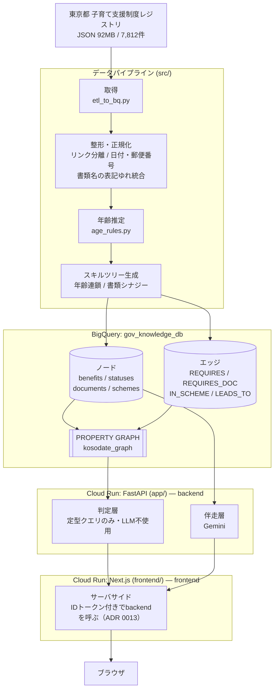

# アーキテクチャ

## 全体像



**backend と frontend は別々の Cloud Run サービス**（ADR 0013）。ブラウザにはメタデータサーバが
無く ID トークンを安全に持てないため、frontend のサーバサイド（Route Handler /
Server Component）が専用サービスアカウント（`kosodate-frontend@...`）で backend を呼ぶ。
**backend は HTML を一切返さない**（`/api/*` と `/api/healthz` のみ）。画面はすべて frontend 側にある。
ただし backend の `allUsers` はまだ外していない（段階導入中。進捗は ADR 0013 参照）。

## 層ごとの責務

### データパイプライン（`src/`）

日次〜週次で回す想定のバッチ。ソース URL から直接 JSON を取得し、ローカルファイルには依存しません。

| ファイル | 責務 |
|---|---|
| `etl_to_bq.py` | エントリポイント（取得・全体の実行順序のみ。`make etl` から呼ばれる） |
| `etl_util.py` | 汎用ヘルパー（ハッシュ、辞書アクセスなど） |
| `etl_normalize.py` | 日付・時刻・郵便番号・埋め込みリンクの正規化 |
| `etl_documents.py` | 必要書類欄の分解・表記ゆれ統合 |
| `etl_statuses.py` | AGE / LOCATION / TAG_* の status ノード生成 |
| `etl_graph.py` | benefits 行の構築・スキルツリー生成・全体変換（`transform`） |
| `etl_schema.py` | BigQuery のテーブルスキーマ定義 |
| `etl_load.py` | BigQuery へのロード |
| `age_rules.py` | 対象年齢のテキスト推定（正規表現のみ。LLM 不使用） |
| `create_graph.sql` / `.py` | PROPERTY GRAPH の定義と実行 |
| `verify_graph.py` | リレーションと属性マッチの動作検証 |

`app/` も責務ごとに分割している:

| ファイル | 責務 |
|---|---|
| `main.py` | アプリ生成・ルーター登録・`/api/healthz`（HTMLは返さない） |
| `dependencies.py` | BigQuery / Gemini クライアントの生成 |
| `queries.py` | 複数ルーターで共通の年齢フィルタSQL |
| `routers/benefits.py` | `/api/categories`, `/api/areas`, `/api/benefits`, `/api/subgraph` |
| `routers/match.py` | `/api/user/profile`, `/api/benefits/match`（Phase2） |
| `routers/timeline.py` | `/api/timeline`（Phase3） |
| `routers/support.py` | `/api/support/draft-review`（Gemini, Phase2） |

整形で行っていること（詳細は `docs/data-model.md`）:
- 本文に `タイトル;URL` 形式で埋め込まれたリンクを分離
- 日付を DATE 型に、郵便番号をハイフン区切りに正規化
- 書類名の表記ゆれ統合、注意書き文の除外
- 対象年齢の推定（カバー率 36% → 66%）

### 判定層（LLM を使わない）

`GET /api/benefits`、`GET /api/benefits/match`、`GET /api/timeline`、`GET /api/subgraph`。

ユーザー属性（居住地コード・子どもの月齢・妊娠中か）を受け取り、
BigQuery の構造化カラムを直接 WHERE 句で比較するだけで対象を確定します。
`match_reasons` として「なぜ当たったか」も返し、UI が根拠を提示できるようにしています。

**この経路に LLM を入れない理由** → [ADR 0001](adr/0001-judgment-vs-llm-separation.md)

### 伴走層（Gemini）

`POST /api/support/draft-review` のみ。

- `explain`: 制度をやさしく言い換える
- `review`: 申請書の下書きを添削する

判定結果を変えることはなく、既に確定した制度情報を分かりやすくするだけです。
プロンプトで「制度情報にないことは補わない」を明示し、レスポンスに disclaimer を付けます。

### フロントエンド（移行中）

Next.js（`frontend/`）に移行中（issue #33）。別の Cloud Run サービスとして動き、
backend へは ID トークン付きでサーバサイドから呼ぶ（ADR 0013）。

| ファイル | 責務 |
|---|---|
| `frontend/lib/backend.ts` | backend を ID トークン付きで呼ぶ共通ヘルパー |
| `frontend/lib/types.ts` | backend レスポンスに対応する型定義 |
| `frontend/app/api/[...path]/route.ts` | backend への catch-all プロキシ（ブラウザから同一オリジンで叩けるようにする） |
| `frontend/components/dads/` | [デジタル庁デザインシステム](https://design.digital.go.jp/dads/react/)のコンポーネント（npm未公開のため個別コピー。詳細は `frontend/README.md`） |
| `frontend/app/page.tsx` | トップページ（一覧ビュー）。`/api/benefits` を取得し、項目＋サマリーのカード一覧を表示する（グラフ表示はしない） |
| `frontend/app/benefits/[id]/page.tsx` | 詳細ビュー（現在はプレースホルダー。本実装は後続PR） |
| `frontend/public/debug.html` | 既存画面（素のJS + cytoscape.js）。`/debug` で配信（`next.config.ts` のリライト） |

既存画面（`/debug`）は移行期間中の動作確認用として frontend 側に残している。
中身のJSは相対パス `/api/...` を叩くので、`app/api/[...path]/route.ts` のプロキシ経由で
backend に届く（ADR 0013 の制約を満たしたまま、クライアントJSを書き換えずに済んでいる）。

`/debug` の主なビュー:
- **グラフ**: 「自分」を中心に対象制度が放射状に並ぶ。制度をタップすると条件・書類だけに絞り込む
- **タイムライン**: 妊娠中〜18歳の8ステージに制度を配置

## デプロイ

```bash
make deploy            # backend: gcloud run deploy --source ./app
make deploy-frontend   # frontend: gcloud run deploy --source ./frontend
```

Cloud Run の `kosodate-graph-viewer`（backend）と `kosodate-frontend`（frontend）、
いずれも asia-northeast1・認証不要で公開（frontendのみ。backendはADR 0013で段階的に
`allUsers` を外していく）。Cloud Build がソースから Docker イメージをビルドします。

## 現時点で未決定・積み残し

- ユーザープロフィールの永続化先（現在はクライアント側のみ）
- データ更新の自動化（Cloud Scheduler + Cloud Run Job）
- タグコードの正式なマスタ入手（現在は統計的推定ラベル）
- 独立した設定画面と、書類チェックリスト／添付添削ビュー
- frontend の staging/prod サービス用に、専用SAを環境ごとに分けるか
  `kosodate-frontend@...` を共有するか（ADR 0013 積み残し）
